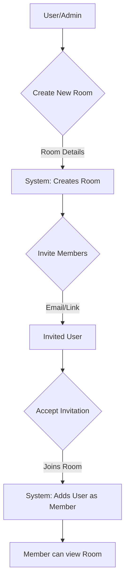
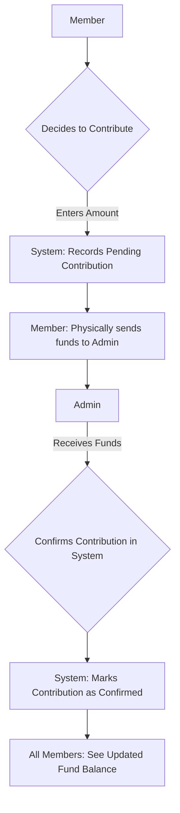
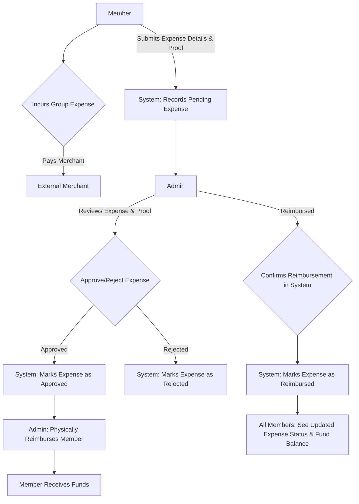

# FinLoop - Shared Fund & Expense Management

FinLoop is a web application designed to simplify the management of shared funds and expenses for groups. It provides a transparent platform where group administrators can create "Rooms," invite members, and oversee all financial activities. Members can contribute to a central fund (managed by the admin) and submit expenses for reimbursement, with all transactions visible to everyone in the room.

## Table of Contents

1.  [Core Idea](#core-idea)
2.  [Key Features](#key-features)
3.  [Core Concepts](#core-concepts)
4.  [Workflow Diagrams](#workflow-diagrams)
    *   [Room Creation & Member Invitation](#room-creation--member-invitation)
    *   [Fund Contribution](#fund-contribution)
    *   [Expense Submission & Reimbursement](#expense-submission--reimbursement)
5.  [Tech Stack](#tech-stack)
6.  [Getting Started](#getting-started)
7.  [Key Functionalities & Code Snippets](#key-functionalities--code-snippets)
    *   [Room Creation](#room-creation)
    *   [Inviting Members](#inviting-members)
    *   [Handling Invitations (Email & Link)](#handling-invitations-email--link)
    *   [Expense Submission](#expense-submission)
    *   [Admin Confirmation of Transactions](#admin-confirmation-of-transactions)
8.  [API Endpoints](#api-endpoints)
9.  [Database Schema Overview](#database-schema-overview)
10. [Learn More (Next.js)](#learn-more-nextjs)
11. [Deploy on Vercel](#deploy-on-vercel)

## Core Idea

FinLoop aims to provide a transparent and straightforward way for groups (e.g., friends, roommates, colleagues, teams) to manage shared finances. The application allows an administrator to create a dedicated space ("Room") for a group, invite members, and track contributions to a central fund. Members can then submit expenses they've incurred on behalf of the group, which the admin can verify and reimburse from the shared fund. All financial activities are logged and visible within the room, ensuring clarity and accountability.

The key principle is that the actual monetary transactions (contributions to the admin, reimbursements from the admin) happen outside the system. FinLoop serves as a ledger and communication tool, where the admin manually confirms these external transactions within the app.

## Key Features

*   **Room Creation**: Admins can create isolated "Rooms" for different groups or purposes.
*   **Member Management**: Admins can invite members to rooms via email or shareable links.
*   **Fund Contributions**: Members can record their contributions to the central fund (held by the admin).
*   **Expense Tracking**: Members can submit expenses with details and proof (e.g., receipts).
*   **Admin Oversight**: Admins manage room settings, members, and verify/confirm all financial transactions.
*   **Transparency**: All members within a room can view contributions, expenses, and the overall financial status.
*   **Manual Confirmations**: Admins manually confirm receipt of contributions and payment of reimbursements within the system.
*   **Expense Verification**: Admins verify expense claims based on uploaded proof before approving reimbursement.

## Core Concepts

*   **Room**: A dedicated space for a group to manage its shared finances. Each room has an admin and members.
*   **Admin**: The creator and manager of a Room. Responsible for inviting members, overseeing finances, confirming contributions, and approving/reimbursing expenses.
*   **Member**: A user invited to a Room. Can contribute funds, submit expenses, and view room finances.
*   **Contribution**: Funds provided by a member to the central pool, which is physically held by the admin. The admin confirms receipt of this contribution in the system.
*   **Expense**: A cost incurred by a member on behalf of the group (e.g., paying for a shared meal, supplies). Members submit these for reimbursement.
*   **Reimbursement**: Payment made by the admin from the central fund to a member for an approved expense. The admin confirms this payment in the system.

## Workflow Diagrams

### Room Creation & Member Invitation



### Fund Contribution



### Expense Submission & Reimbursement



## Tech Stack

*   **Framework**: [Next.js](https://nextjs.org/) (React framework)
*   **Backend/Database**: [Supabase](https://supabase.io/) (PostgreSQL, Authentication, Realtime)
*   **Styling**: [Tailwind CSS](https://tailwindcss.com/) (Utility-first CSS framework)
*   **UI Components**: [Shadcn/ui](https://ui.shadcn.com/) (Potentially, if used) or custom components
*   **Icons**: [Lucide React](https://lucide.dev/)

## Getting Started

First, ensure you have Node.js and npm (or yarn/pnpm/bun) installed.

1.  **Clone the repository:**
    ```bash
    git clone <your-repository-url>
    cd finloop
    ```

2.  **Install dependencies:**
    ```bash
    npm install
    # or
    yarn install
    # or
    pnpm install
    # or
    bun install
    ```

3.  **Set up Environment Variables:**
    Create a `.env.local` file in the root of your project and add your Supabase credentials:
    ```env
    NEXT_PUBLIC_SUPABASE_URL=your_supabase_url
    NEXT_PUBLIC_SUPABASE_ANON_KEY=your_supabase_anon_key
    SUPABASE_SERVICE_ROLE_KEY=your_supabase_service_role_key # For admin actions
    
    # Optional: For email sending if not using Supabase built-in
    # RESEND_API_KEY=your_resend_api_key 
    
    NEXT_PUBLIC_SITE_URL=http://localhost:3000 # Important for email links
    ```
    Replace `your_supabase_url`, `your_supabase_anon_key`, and `your_supabase_service_role_key` with your actual Supabase project details.

4.  **Run the development server:**
    ```bash
    npm run dev
    # or
    yarn dev
    # or
    pnpm dev
    # or
    bun dev
    ```

Open [http://localhost:3000](http://localhost:3000) with your browser to see the result.

You can start editing the page by modifying `app/page.tsx`. The page auto-updates as you edit the file.

This project uses [`next/font`](https://nextjs.org/docs/app/building-your-application/optimizing/fonts) to automatically optimize and load [Geist](https://vercel.com/font), a new font family for Vercel.

## Key Functionalities & Code Snippets

*(Illustrative examples - actual implementation might vary)*

### Room Creation
An admin initiates the creation of a new room.
```typescript
// Example: src/app/api/rooms/route.ts (simplified)
export async function POST(request: Request) {
  // ... get user from Supabase auth
  // ... parse request body for room name, description
  
  const { data: room, error } = await supabase
    .from('rooms')
    .insert({ name, description, admin_id: user.id })
    .select()
    .single();

  if (error) { /* handle error */ }
  // Also add admin as a member of the room
  // ...
  return NextResponse.json(room);
}
```

### Inviting Members
Admins can invite users to a room. This often involves generating a unique invite code or sending an email.
```typescript
// Example: src/app/api/rooms/[id]/invite/email/route.ts (simplified)
export async function POST(request: Request, { params }: { params: { id: string } }) {
  const roomId = params.id;
  const { email, message } = await request.json();
  // ... verify admin privileges for the room
  // ... generate unique invite_code
  // ... store invite_code in 'room_invites' table with roomId, email, expiry

  // Logic to handle existing vs new users:
  // 1. Check if user with 'email' exists.
  // 2. If exists & not in room: Add to 'room_members', send notification email.
  // 3. If exists & already in room: Send "already a member" notification.
  // 4. If new user: Use supabaseAdmin.auth.admin.inviteUserByEmail() or send custom email with signup + join link.
  
  // ... (refer to the detailed invite logic previously discussed)
  return NextResponse.json({ success: true, message: "Invite processed." });
}
```

### Handling Invitations (Email & Link)
Users click an invitation link, which might contain a token or invite code.
```typescript
// Example: src/app/rooms/join/[inviteCode]/page.tsx (simplified)
export default async function JoinRoomPage({ params }: { params: { inviteCode: string } }) {
  // ... get current user
  // 1. Validate inviteCode against 'room_invites' table.
  // 2. Check if invite is valid (not expired, uses left).
  // 3. If user is not logged in, redirect to login/signup, then back to join.
  // 4. If user logged in:
  //    - Check if already a member of the room.
  //    - If not, add user to 'room_members' table for the associated room_id.
  //    - Decrement uses or mark invite as used.
  //    - Redirect to the room page.
  // ...
}
```

### Expense Submission
Members submit expenses they've paid for.
```typescript
// Example: Component for submitting an expense (simplified client-side)
async function submitExpense(roomId: string, amount: number, description: string, proofFile?: File) {
  const formData = new FormData();
  formData.append('roomId', roomId);
  formData.append('amount', amount.toString());
  formData.append('description', description);
  if (proofFile) {
    formData.append('proof', proofFile); // Handle file upload to Supabase Storage
  }

  const response = await fetch(`/api/rooms/${roomId}/expenses`, {
    method: 'POST',
    body: formData, // Or JSON if not handling file uploads directly here
  });
  // ... handle response
}
```

### Admin Confirmation of Transactions
Admins manually confirm contributions received or reimbursements paid.
```typescript
// Example: API to confirm a contribution (simplified)
// PUT /api/rooms/[roomId]/contributions/[contributionId]/confirm
export async function PUT(request: Request, { params }: { params: { roomId: string, contributionId: string } }) {
  // ... verify admin privileges for the room
  const { data, error } = await supabase
    .from('contributions')
    .update({ status: 'confirmed', confirmed_at: new Date().toISOString() })
    .eq('id', params.contributionId)
    .eq('room_id', params.roomId);
  // ... handle response
  return NextResponse.json({ success: true });
}
```

## API Endpoints

Here's a list of key API endpoints (this can be expanded):

*   **Authentication (Handled by Supabase SDK & Next.js Middleware/Route Handlers)**
    *   `/auth/signup`
    *   `/auth/login`
    *   `/auth/signout`
    *   `/api/auth/callback` (Supabase redirect)
    *   `/api/auth/confirm-invite` (Custom for invite flow)

*   **Rooms**
    *   `GET /api/rooms`: List rooms for the current user (created and member of).
    *   `POST /api/rooms`: Create a new room.
    *   `GET /api/rooms/[id]`: Get details of a specific room.
    *   `PUT /api/rooms/[id]`: Update room details (admin only).
    *   `DELETE /api/rooms/[id]`: Delete a room (admin only).

*   **Room Invitations & Members**
    *   `POST /api/rooms/[id]/invite`: Generate a shareable invite link/code.
    *   `POST /api/rooms/[id]/invite/email`: Send an email invitation.
    *   `GET /api/rooms/join/[inviteCode]`: Endpoint to process joining via an invite code (often handled by a page).
    *   `GET /api/rooms/[id]/members`: List members of a room.
    *   `DELETE /api/rooms/[id]/members/[userId]`: Remove a member from a room (admin only).

*   **Contributions**
    *   `GET /api/rooms/[id]/contributions`: List contributions for a room.
    *   `POST /api/rooms/[id]/contributions`: Record a new (pending) contribution by a member.
    *   `PUT /api/rooms/[id]/contributions/[contributionId]/confirm`: Admin confirms receipt of a contribution.

*   **Expenses**
    *   `GET /api/rooms/[id]/expenses`: List expenses for a room.
    *   `POST /api/rooms/[id]/expenses`: Member submits a new expense claim (with proof).
    *   `PUT /api/rooms/[id]/expenses/[expenseId]/approve`: Admin approves an expense claim.
    *   `PUT /api/rooms/[id]/expenses/[expenseId]/reimburse`: Admin confirms reimbursement of an expense.
    *   `GET /api/expenses/proof/[proofId]`: (If storing proofs separately) Endpoint to serve proof files.

*   **User Profile**
    *   `GET /api/profile`: Get current user's profile.
    *   `PUT /api/profile`: Update user's profile (e.g., name, avatar).

## Database Schema Overview

A simplified overview of potential Supabase tables:

*   **`users` (managed by Supabase Auth)**: Stores user authentication data.
*   **`profile`**: Stores additional user profile information (e.g., `id` (FK to `auth.users`), `full_name`, `avatar_url`).
    *   `id (uuid, primary key, references auth.users.id)`
    *   `full_name (text)`
    *   `avatar_url (text)`
    *   `updated_at (timestampz)`

*   **`rooms`**: Stores information about each shared fund room.
    *   `id (uuid, primary key)`
    *   `name (text, not null)`
    *   `description (text)`
    *   `admin_id (uuid, not null, references auth.users.id)`
    *   `created_at (timestampz, default now())`
    *   `updated_at (timestampz)`

*   **`room_members`**: Links users to rooms they are part of.
    *   `id (uuid, primary key)`
    *   `room_id (uuid, not null, references rooms.id)`
    *   `user_id (uuid, not null, references auth.users.id)`
    *   `role (text, default 'member')` (e.g., 'admin', 'member')
    *   `joined_at (timestampz, default now())`
    *   `UNIQUE (room_id, user_id)`

*   **`room_invites`**: Stores invitation codes/links for rooms.
    *   `id (uuid, primary key)`
    *   `room_id (uuid, not null, references rooms.id)`
    *   `invite_code (text, unique, not null)`
    *   `created_by (uuid, references auth.users.id)`
    *   `email (text)` (Optional, if invite is email-specific)
    *   `expires_at (timestampz)`
    *   `max_uses (integer)`
    *   `current_uses (integer, default 0)`
    *   `created_at (timestampz, default now())`

*   **`contributions`**: Records funds contributed by members.
    *   `id (uuid, primary key)`
    *   `room_id (uuid, not null, references rooms.id)`
    *   `user_id (uuid, not null, references auth.users.id)`
    *   `amount (decimal, not null)`
    *   `status (text, default 'pending')` (e.g., 'pending', 'confirmed')
    *   `contribution_date (date, default now())`
    *   `confirmed_at (timestampz)`
    *   `created_at (timestampz, default now())`

*   **`expenses`**: Tracks expenses submitted by members.
    *   `id (uuid, primary key)`
    *   `room_id (uuid, not null, references rooms.id)`
    *   `user_id (uuid, not null, references auth.users.id)` (user who submitted)
    *   `description (text, not null)`
    *   `amount (decimal, not null)`
    *   `status (text, default 'pending')` (e.g., 'pending', 'approved', 'reimbursed', 'rejected')
    *   `expense_date (date, default now())`
    *   `proof_url (text)` (Link to uploaded receipt/proof in Supabase Storage)
    *   `notes (text)`
    *   `approved_at (timestampz)`
    *   `reimbursed_at (timestampz)`
    *   `created_at (timestampz, default now())`

*   **`email_queue`** (If implementing a custom email sending queue):
    *   `id (uuid, primary key)`
    *   `to_email (text)`
    *   `subject (text)`
    *   `html_content (text)`
    *   `status (text, default 'pending')` ('pending', 'sent', 'failed')
    *   `sent_at (timestampz)`
    *   `attempts (integer, default 0)`
    *   `room_id (uuid, references rooms.id, nullable)`
    *   `invite_code (text, nullable)`
    *   `created_at (timestampz, default now())`

*(Remember to set up Row Level Security (RLS) policies in Supabase for these tables to ensure data privacy and security.)*